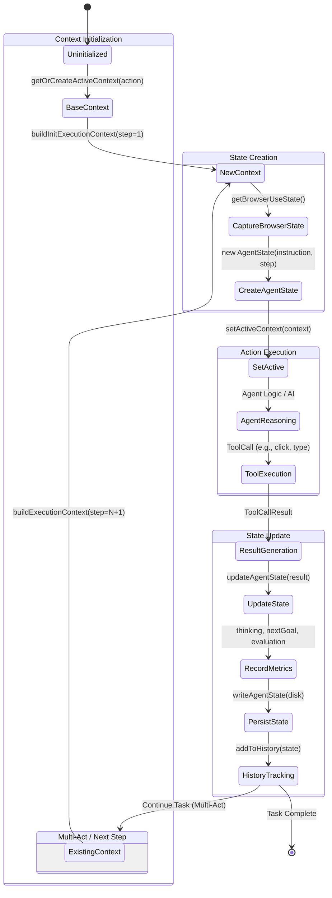

# Agent State Transformation

This document details the state transformation process within the Browser4 Agent system, specifically focusing on the `AgentStateManager`, `ExecutionContext`, and `AgentState` classes.

## Overview

The agent's lifecycle is managed by the `AgentStateManager`, which orchestrates the creation of execution contexts and the tracking of agent states. Each step in an agent's operation corresponds to a distinct state transition, capturing the browser's condition, the agent's reasoning, and the actions performed.

## State Transformation Diagram

The following diagram illustrates the lifecycle of an agent's state during a task execution.

## Detailed Analysis

### 1. ExecutionContext

The `ExecutionContext` serves as the container for a single step in the agent's workflow. It links the immutable instructions with the mutable state of the world.

*   **Role**:
    *   Maintains the `sessionId` and `step` number.
    *   Holds the user's original `instruction` (invariant across steps).
    *   References the current `AgentState`.
    *   Provides context for logging and debugging (e.g., `step.context.log`).

*   **Key Properties**:
    *   `step`: The sequential step number (1, 2, 3...).
    *   `instruction`: The high-level goal provided by the user.
    *   `sessionId`: A unique identifier for the entire session.
    *   `agentState`: The detailed state object for this step.
    *   `config`: Configuration parameters for the agent.

*   **Creation Flow**:
    *   **Initial**: `buildInitExecutionContext` creates Step 1.
    *   **Subsequent**: `buildExecutionContext` creates Step N+1, inheriting `sessionId` and `instruction` from the previous context, ensuring continuity.

### 2. AgentState

The `AgentState` represents the complete snapshot of the agent's world at a specific moment in time. It is the primary data structure used for reasoning and history tracking.

*   **Role**:
    *   Captures the **External State**: The browser's URL, DOM snapshot, and active tabs (`BrowserUseState`).
    *   Captures the **Internal State**: The agent's thinking process (`thinking`), evaluation of the previous goal (`evaluationPreviousGoal`), and the next planned goal (`nextGoal`).
    *   Captures the **Action State**: The tool call executed (`toolCall`), its result (`toolCallResult`), and any exceptions.
    *   Links to the **Previous State**: Contains a reference to `prevState`, forming a linked list of history.

*   **Lifecycle**:
    1.  **Created**: Instantiated with the current browser state and instruction.
    2.  **Updated**: Populated with the results of the agent's action (tool call result) and the AI's cognitive output (thinking, summary).
    3.  **Finalized**: Written to disk and added to `AgentHistory`.

*   **Key Properties**:
    *   `browserUseState`: The DOM and browser tab information.
    *   `toolCall`: The specific action taken (domain, method, args).
    *   `toolCallResult`: The outcome of the action (success/failure, return value).
    *   `thinking`: The AI's internal monologue explaining *why* it took the action.
    *   `nextGoal`: The immediate objective for the next step.

### 3. AgentStateManager

The `AgentStateManager` is the central controller that drives the state transitions.

*   **Responsibilities**:
    *   **Context Management**: Ensures strictly sequential execution steps (1 -> 2 -> 3). It validates that the new context correctly inherits from the previous one.
    *   **State Persistence**: Writes every state change to disk (`logs/agent/...`) for debugging and replayability.
    *   **History Tracking**: Maintains a list of all past `AgentState` objects in `AgentHistory`, allowing the agent to "remember" past actions and avoid loops.
    *   **Browser Synchronization**: Ensures the DOM is stable (`waitForDOMSettle`) before capturing the state.

### Transition Flow

1.  **Initialization**: The process begins with `getOrCreateActiveContext`. If no context exists, a base context (Step 1) is created.
2.  **Perception**: `getAgentState` is called. It captures the current `BrowserUseState` (DOM, tabs) to understand the environment.
3.  **Action**: The agent decides on an action.
4.  **Update**: `updateAgentState` is called with the `DetailedActResult`. This enriches the `AgentState` with the action's outcome and the AI's reasoning.
5.  **History**: The completed `AgentState` is added to `AgentHistory`.
6.  **Loop**: If the task is not complete, the cycle repeats. The `AgentStateManager` uses the last context to build the next one (Step N+1), linking the new state to the previous one via `prevState`.
