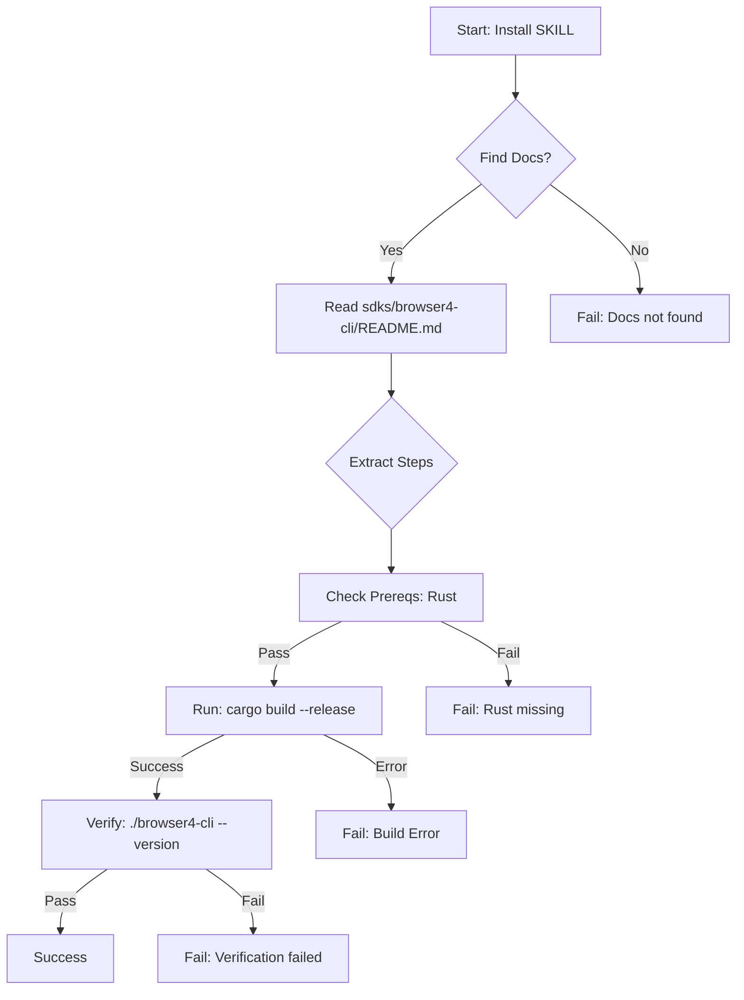

# 方案设计：SKILL (Browser4-CLI) 自动化安装

本方案旨在使 Agent 能够通过阅读文档，自主完成 `browser4-cli` (SKILL) 的安装与验证。

## 1. 核心流程设计

### 第一阶段：信息检索与阅读 (Read & Understand)

1.  **定位文档**
    *   **动作**：Agent 在 `sdks/` 目录下搜索 `README.md`、`INSTALL.md` 或 `SKILL.md`。
    *   **逻辑**：
        *   优先检查 `sdks/skill/SKILL.md` (元数据/入口)。
        *   发现 `name: browser4-cli`，定位到源码目录 `sdks/browser4-cli/`。
        *   读取 `sdks/browser4-cli/README.md`。
2.  **内容解析 (LLM/Regex)**
    *   **动作**：从 README 中提取安装/构建指令。
    *   **关键信息提取**：
        *   **依赖**：`Rust 1.70+` (From "Prerequisites").
        *   **路径**：`sdks/browser4-cli` (From "Build" section: `cd sdks/browser4-cli`).
        *   **命令**：`cargo build --release` (From "Build" section).
        *   **产物**：`target/release/browser4-cli` (From "Build" section).

### 第二阶段：执行与验证 (Execute & Verify)

1.  **环境检查**
    *   **动作**：执行 `rustc --version` 和 `cargo --version`。
    *   **判断**：
        *   若返回版本号 >= 1.70，继续。
        *   若未找到命令或版本过低，中断并报告“环境缺失：Rust”。
2.  **执行安装**
    *   **动作**：
        ```bash
        cd sdks/browser4-cli
        cargo build --release
        ```
    *   **监控**：等待命令结束，检查退出代码 (Exit Code 0 为成功)。
3.  **结果验证**
    *   **动作**：
        ```bash
        ./target/release/browser4-cli --version
        ```
    *   **判定**：若输出版本信息 (e.g., `browser4-cli 0.1.0`)，则任务成功。

## 2. 异常处理机制

*   **文档缺失**：若 `sdks/browser4-cli/README.md` 不存在，搜索项目根目录 `README.md` 是否包含 `browser4-cli` 关键词。
*   **构建失败**：
    *   捕获 `cargo build` 的 `stderr`。
    *   若错误包含 `network` 或 `registry`，重试 (可能需要代理)。
    *   若错误包含 `compilation error`，记录日志并通知开发者 (不尝试自动修复源码)。
*   **环境不满足**：若 Rust 未安装，Agent 仅报告缺失，不尝试自动安装 Rust 工具链 (避免污染环境)。

## 3. Agent 能力与工具清单

为了执行上述流程，Agent 需要具备以下能力（映射到 MCP 工具）：

| 能力分类 | 描述 | 对应工具/API |
| :--- | :--- | :--- |
| **文件操作** | 浏览目录结构，读取文档内容 | `list_files`, `read_file` (glob/view) |
| **Shell 执行** | 运行环境检查和构建命令 | `powershell` / `bash` |
| **文本理解** | 从 Markdown 中提取结构化步骤 | LLM Inference (Prompting) |
| **路径感知** | 理解相对路径与当前工作目录 | `pwd`, `cd` 上下文管理 |

## 4. 示例流程图 (Text)


